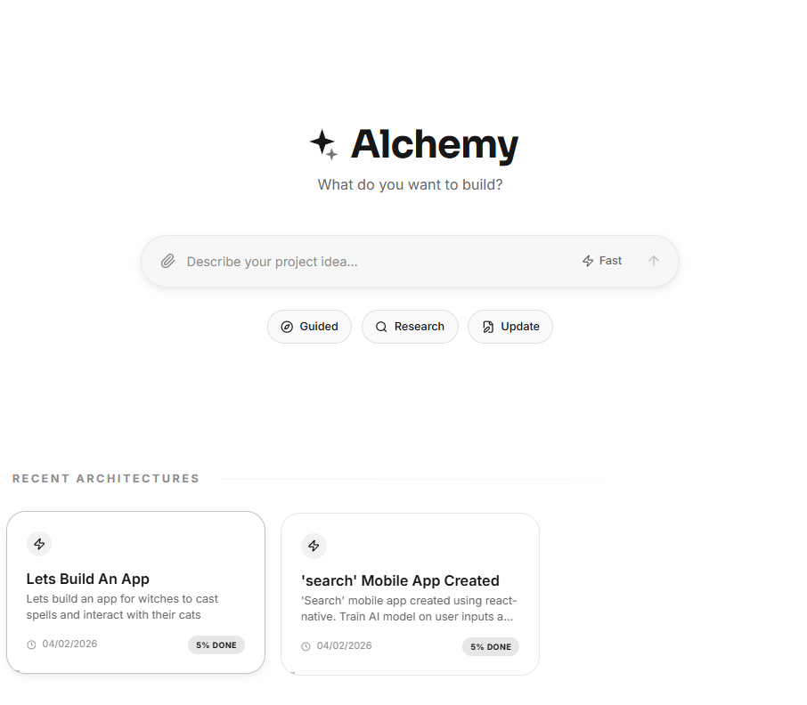
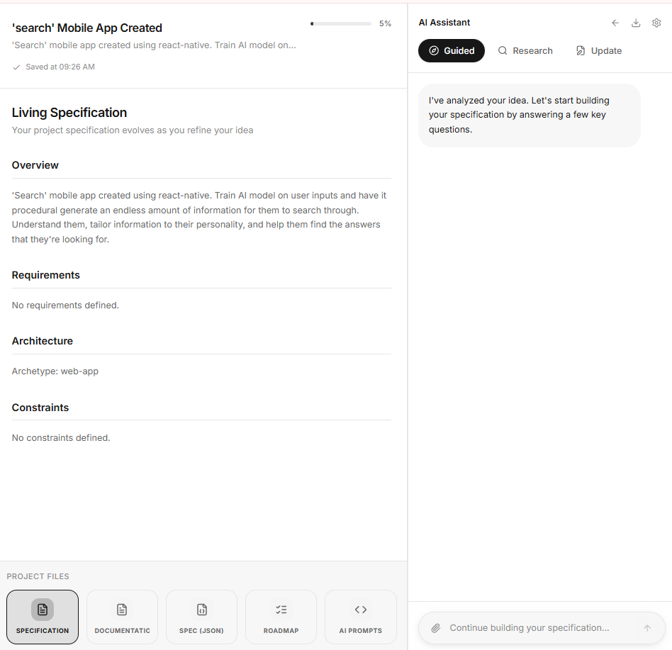

# Alchemy - Bring Your Ideas to Life

**Turning thoughts into technical blueprints. Where ideas meet architecture.**

## 🚀 Overview
**Alchemy** is a production-grade, full-stack AI platform designed to transform vague software concepts into build-ready technical specifications. It bridges the gap between "having an idea" and "being ready to build" by enforcing architectural rigor, eliminating requirements ambiguity, and compiling everything into a machine-readable JSON source of truth.

This project serves as a technical showcase for **AI Orchestration**, **Schema-Driven Development**, and **Premium UI/UX Design**.

## 📸 Screenshots
| Landing Page | Project Workspace |
| :--- | :--- |
|  |  |

## � Key Features

### 💻 Application Layer
*   **Intuitive Workspace**: A sleek, two-column professional interface built with **React**, **Vite**, and **TypeScript**.
*   **Multi-Mode AI Assistant**: Seamless communication via a **FastAPI** backend with specialized modes:
    *   **Guided**: Linear design discovery following a strict roadmap.
    *   **Research**: Non-destructive technical exploration and trade-off analysis.
    *   **Update**: Fluid refinement of previously made architectural decisions.
*   **Artifact Carousel**: Real-time generation and preview of Documentation, JSON Specifications, Roadmaps, and AI Prompts.
*   **UK-Localized UX**: Professional design with UK date tokens and high-contrast accessibility.

### 🛡️ Engineering & Architecture Layer
*   **Canonical Source of Truth**: All project data is backed by a strictly validated **Pydantic JSON Schema**, ensuring 100% referential integrity.
*   **Deterministic State Machine**: A roadmap engine that identifies intent, classifies user input, and applies validated mutations to the project state.
*   **AI-Optimized Prompts**: Automatically compiles the implementation roadmap into sequential, context-bounded markdown prompts for use in AI IDEs (Cursor, Windsurf, Replit).
*   **Time-Travel Checkpointing**: Every decision creates a timestamped snapshot, allowing users to revert or branch architectural paths.
*   **Local-First Privacy**: Designed for high-speed local development with no external tracking or cloud persistence required.

## 🛠️ Technology Stack

| Core | Infrastructure | Design & Tooling |
| :--- | :--- | :--- |
| **Frontend**: React, Vite, TS | **Orchestration**: FastAPI (Python) | **Styling**: Shadcn UI, Tailwind |
| **Backend**: Python 3.10+ | **Validation**: Pydantic v2 | **Icons**: Lucide React |
| **State**: React Hooks | **Persistence**: Local Filesystem | **Architecture**: Monorepo-style |
| **Logic**: Prompt Engineering | **Testing**: Pytest & Vitest | **Format**: Markdown, JSON |

## 🏗️ Technical Depth: The Spec Compiler
The heart of Alchemy isn't just a chatbot—it's a **State Machine**. Unlike typical AI wrappers, Alchemy:
1.  **Classifies Intent**: Determines if you are answering a roadmap question, researching a tech stack, or requesting a change.
2.  **Validates against Schema**: Every AI suggestion is checked against a rigid project schema before reaching the UI.
3.  **Generates Deterministic Roadmap**: Derives a phased implementation plan based on the chosen technologies and frontend/backend architecture.
4.  **Sequential Execution**: Prompts are context-bounded, meaning Phase 2 only receives the context needed to build on Phase 1, minimizing AI hallucinations.

## ⚙️ Installation & Usage

### 🐍 Backend Setup (FastAPI)
1. Navigate to `backend` and create a virtual environment:
   ```bash
   python -m venv venv
   source venv/bin/activate # Windows: venv\Scripts\activate
   ```
2. Install dependencies and start the server:
   ```bash
   pip install -r requirements.txt
   uvicorn app.main:app --reload
   ```

### ⚛️ Frontend Setup (React/Vite)
1. Navigate to `frontend` and install packages:
   ```bash
   npm install
   ```
2. Run the development server:
   ```bash
   npm run dev
   ```

## 📜 Roadmap & Philosophy
Alchemy is built on the philosophy that **clear specifications are the currency of AI development**. From guided discovery to automated implementation planning, this project demonstrates a commitment to professional software engineering standards in the era of Generative AI.

## 🖋️ Author
**Kieran Archi**
*DevOps Engineer & Full-Stack Developer*
[GitHub Profile](https://github.com/KieranArchi98)